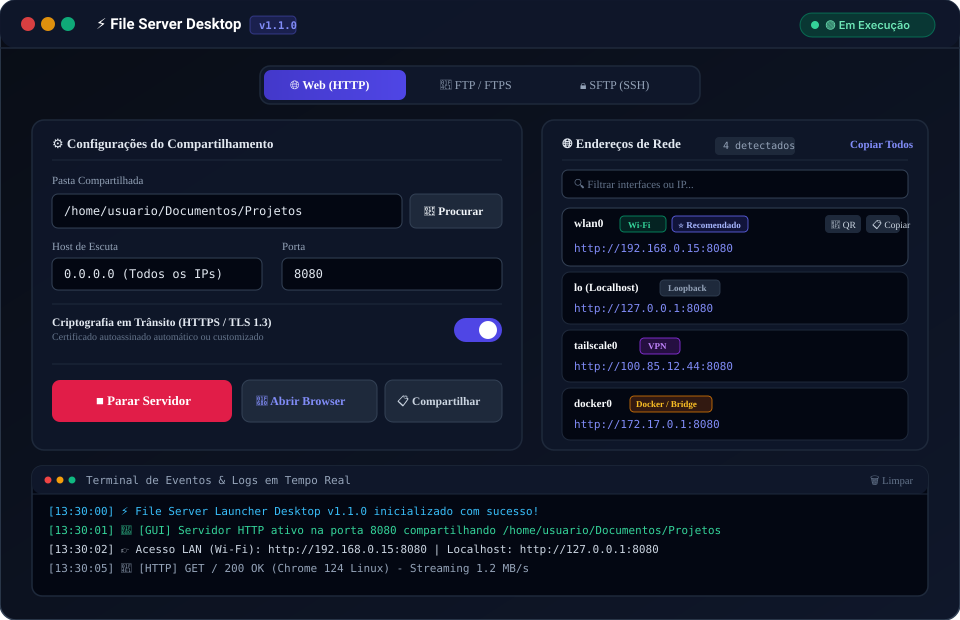

<p align="center">
  
</p>

# ⚡ File Server

[](https://golang.org)
[](.github/workflows/ci.yml)
[](scripts/coverage.sh)
[](#-arquitetura-e-estrutura-de-pacotes)
[](#-compilação-multiplataforma)
[](LICENSE)

> Servidor de arquivos de alta performance para rede local (LAN) com **Interface Gráfica Desktop Nativa (GNOME Adwaita Dark)**, **Ícone Oficial em Alta Resolução Embutido no Executável e Barra de Tarefas**, suporte a protocolos **Web (HTTP/HTTPS)**, **SFTP (SSHv2)** e **FTP/FTPS**, streaming direto com HTTP Range (206), downloads de pastas compactadas em ZIP sob demanda (zero resíduos em disco), uploads multipart/drag-and-drop, isolamento estrito de sandbox contra path traversal e criptografia em trânsito. Empacotado em um **único binário executável 100% autocontido e portátil** (`go:embed`).

---

## 🖥️ Como Usar: Interface Gráfica Desktop (Modo Principal)

O **File Server** foi projetado para oferecer uma experiência visual moderna, intuitiva e imediata no desktop. Ao clicar duas vezes no executável ou executar o binário sem parâmetros em seu ambiente gráfico, a interface desktop nativa é inicializada automaticamente.

<p align="center">
  
</p>

### 🎯 Passo a Passo de Utilização da GUI

1. **Inicialização Automática**:
   - Basta clicar duas vezes no executável `file-server` ou rodar `./bin/file-server` no terminal.
   - O launcher desktop abre instantaneamente com tema escuro elegante baseado no design system **GNOME Adwaita Dark** (`slate-900`/`slate-950`, acentos `indigo-500` e bordas `slate-800`).

2. **Escolha da Pasta e Protocolo**:
   - **Pasta Compartilhada**: Clique no botão **📂 Procurar** para abrir a caixa de diálogo nativa do seu sistema operacional (*Folder Picker*) e escolher qualquer pasta com facilidade.
   - **Seletor de Modo**: Alterne com um clique entre **🌐 Web (HTTP/HTTPS)**, **📁 FTP / FTPS** ou **🔒 SFTP (SSH)**. As portas padrão recomendadas (`8080`, `2121`, `2222`) são preenchidas automaticamente.

3. **Segurança e Criptografia em Trânsito**:
   - Ative o seletor de **Criptografia (TLS)** para proteger todas as transferências com certificados autoassinados instantâneos ou selecione seus próprios arquivos PEM de certificado e chave.
   - Para FTP e SFTP, utilize o botão **🎲 Gerar** para criar senhas temporárias seguras de 12 caracteres com um clique.

4. **Descoberta Escalável de Múltiplos IPs & Compartilhamento**:
   - **Viewport Rolável Inteligente**: Visualize com clareza todos os adaptadores de rede disponíveis na sua máquina (Wi-Fi, Ethernet, VPNs como Tailscale/WireGuard, Docker Bridges e WSL) sem poluir a janela.
   - **Tags e Destaques**: O endereço primário recomendado de rede física e o Loopback são fixados no topo com tags visuais (`Wi-Fi`, `Ethernet`, `VPN`, `Docker`).
   - **Cópia em 1 Clique**: Clique em `📋 Copiar` ao lado de qualquer endereço ou no botão **Copiar Todos** com feedback imediato (*"✓ Copiado!"*).
   - **📱 Modal de QR Code**: Clique no ícone de QR Code para exibir o código na tela e conectar smartphones ou tablets na mesma rede Wi-Fi instantaneamente.
   - **📋 Compartilhar Link**: Gera e copia uma mensagem formatada com o resumo do compartilhamento, links e credenciais pronta para envio no Slack, WhatsApp, Teams ou Discord.

5. **Controle de Execução e Logs em Tempo Real**:
   - Clique em **▶ Iniciar Servidor** para ativar o serviço.
   - Use o botão direto **🚀 Abrir no Navegador** para acessar o explorador web com um único clique.
   - Acompanhe acessos, downloads e requisições no **Terminal de Eventos & Logs** integrado na parte inferior da janela com auto-scroll em tempo real via Server-Sent Events (SSE).

---

## 💻 Modo Linha de Comando (CLI Avançado & Headless)

Para ambientes de servidores puros sem interface gráfica (SSH, VPS, contêineres Docker ou automações CI/CD), o File Server oferece uma CLI completa e retrocompatível.

### 1. Catálogo Completo de Comandos da CLI

| Comando / Flag | Descrição | Exemplo de Uso |
| :--- | :--- | :--- |
| `file-server [dir]` | Inicia a GUI (em desktop) ou o servidor Web na pasta informada | `./bin/file-server` ou `./bin/file-server /meus/dados` |
| `file-server gui [dir]` | Inicia explicitamente a interface gráfica desktop | `./bin/file-server gui ~/Documentos` |
| `file-server serve [dir]` | Subcomando explícito para iniciar o servidor web HTTP/HTTPS | `./bin/file-server serve ./dados -p 8080` |
| `file-server sftp [dir]` | Inicia o servidor SFTP seguro sobre SSH com chaves e senha | `./bin/file-server sftp ./dados -p 2222` |
| `file-server ftp [dir]` | Inicia o servidor FTP com suporte a FTPS (TLS) e modo passivo | `./bin/file-server ftp ./dados -p 2121 --tls` |
| `--gui` | Força a inicialização da interface gráfica desktop | `./bin/file-server --gui` |
| `--no-open` | Inicia o servidor da GUI sem abrir o navegador/janela automaticamente | `./bin/file-server gui --no-open` |
| `--dir` (`-d`) | Define o caminho do diretório raiz a ser compartilhado | `./bin/file-server -d /var/public` |
| `--port` (`-p`) | Define a porta TCP de escuta (Web: `8080`, SFTP: `2222`, FTP: `2121`) | `./bin/file-server sftp -p 2222` |
| `--host` | Define o endereço IP/host de escuta (default: `0.0.0.0`) | `./bin/file-server --host 127.0.0.1` |
| `--user` (`-u`) | Define o usuário para autenticação SFTP ou FTP (default: `fileserver`) | `./bin/file-server sftp -u admin -P segredo` |
| `--pass` (`-P`) | Define a senha de autenticação (gerada automaticamente caso omitida) | `./bin/file-server ftp -P MinhaSenha123` |
| `--auth-key` (`-k`) | Caminho da chave pública SSH autorizada para login SFTP | `./bin/file-server sftp -k ~/.ssh/id_ed25519.pub` |
| `--host-key` | Caminho da chave privada de host SSH (gerada em memória caso omitida) | `./bin/file-server sftp --host-key host.pem` |
| `--tls` (`-s`) | Ativa criptografia segura TLS/HTTPS ou FTPS (certificado autoassinado automático) | `./bin/file-server -s` ou `./bin/file-server ftp --tls` |
| `--tls-cert` | Caminho do arquivo PEM com certificado público TLS customizado | `./bin/file-server serve --tls-cert cert.pem --tls-key key.pem` |
| `--tls-key` | Caminho do arquivo PEM com chave privada TLS customizada | `./bin/file-server ftp --tls-cert cert.pem --tls-key key.pem` |
| `--passive-ports` | Faixa de portas para o modo passivo FTP (ex: `50000-50100`) | `./bin/file-server ftp --passive-ports 50000-50100` |
| `--read-only` (`-r`) | Ativa modo somente leitura (bloqueia uploads, edições e remoções) | `./bin/file-server sftp -r` ou `./bin/file-server ftp -r` |
| `file-server version` | Exibe versão semântica, commit, data de build e plataforma | `./bin/file-server version` |
| `file-server --help` (`-h`) | Exibe a ajuda interativa completa da CLI | `./bin/file-server --help` |

---

### 2. Exemplos de Execução Headless via Terminal

#### Servidor SFTP Seguro (Recomendado para Redes Locais)
```bash
# Inicia servidor SFTP na pasta ~/Documentos na porta 2222 com senha temporária segura
./bin/file-server sftp ~/Documentos -p 2222

# Ou configurando usuário e senha explícitos:
./bin/file-server sftp /dados -u admin -P SegredoForte123

# Conectar via terminal:
sftp -P 2222 admin@<ip-do-servidor>

# Ou via FileZilla / Cyberduck / WinSCP:
# Protocolo: SFTP (SSH File Transfer Protocol) | Host: <ip-do-servidor> | Porta: 2222
```

#### Servidor FTP com Criptografia FTPS / TLS
```bash
# Inicia servidor FTP com FTPS ativado na porta 2121
./bin/file-server ftp /dados -p 2121 --tls -u transfer -P Senha123
```

#### Servidor Web Seguro com HTTPS / TLS
```bash
# Inicia na porta 8443 com HTTPS e certificado autoassinado automático
./bin/file-server serve /dados -s -p 8443
```

---

## 🌐 Guia do Explorador Web de Arquivos

Quando o modo **Web (HTTP/HTTPS)** é iniciado, os usuários na rede local podem acessar o explorador web completo diretamente pelo navegador:

1. **Navegação por Breadcrumbs**: Navegue recursivamente por diretórios e subdiretórios com navegação instantânea por migalhas de pão no topo da tela.
2. **Busca e Filtro em Tempo Real**: Digite no campo de pesquisa para filtrar instantaneamente os arquivos visíveis via Alpine.js sem recarregar a página.
3. **Download com HTTP Range (206)**: Download de arquivos de qualquer tamanho com suporte nativo a pausas, retomadas e streaming direto de vídeos e áudios.
4. **Download de Pastas em ZIP via Streaming**: Compactação sob demanda em streaming direto (`io.Writer`) sem gravar arquivos temporários em disco.
5. **Uploads Drag & Drop em Lote**: Arraste múltiplos arquivos diretamente do seu computador e solte sobre a janela do navegador para iniciar o envio com barra de progresso.

---

## 📡 Catálogo de Rotas e Endpoints da API

| Método | Rota | Descrição |
| :--- | :--- | :--- |
| `GET` | `/` ou `/files/*` | Interface gráfica do explorador de arquivos (HTML/SSR) |
| `GET` | `/api/files/*` | Metadados e listagem do diretório em formato JSON |
| `GET` | `/download/*` | Download de arquivo individual com suporte a HTTP Range (206) |
| `GET` | `/zip/*` | Download de diretório compactado em `.zip` via streaming sob demanda |
| `POST`| `/upload/*` | Upload multipart de arquivos para o diretório de destino |
| `GET` | `/status` | Painel web de diagnóstico e integridade dos serviços |
| `GET` | `/api/health` | Status de saúde e métricas de uptime em JSON |
| `GET` | `/api/interfaces` | Detecção categorizada de adaptadores de rede e URLs ativas |
| `GET` | `/api/logs/stream` | Streaming de logs em tempo real via Server-Sent Events (SSE) |
| `POST`| `/api/server/start` | Inicia servidor em background (Web, FTP ou SFTP) via API do launcher |
| `POST`| `/api/server/stop` | Interrompe o servidor ativo graciosamente |
| `POST`| `/api/picker/folder` | Abre diálogo nativo do sistema operacional para seleção de pasta |
| `POST`| `/api/app/open-browser`| Abre URL no navegador padrão do sistema operacional |
| `POST`| `/api/app/close` | Realiza o shutdown gracioso e finaliza a aplicação desktop |

---

## 🛠️ Guia para Desenvolvedores & Padrões de Qualidade

Esta seção descreve os padrões de engenharia de software e Clean Architecture empregados no projeto.

### 🏗️ Arquitetura e Estrutura de Pacotes

```
file-server/
├── cmd/                          # Camada de entrada da CLI (Cobra)
│   ├── root.go                   # Comando raiz com detecção automática de GUI
│   ├── gui.go                    # Subcomando 'gui' desktop launcher
│   ├── serve.go                  # Subcomando 'serve' (Web HTTP/HTTPS)
│   ├── sftp.go                   # Subcomando 'sftp' (SFTP sobre SSH)
│   ├── ftp.go                    # Subcomando 'ftp' (FTP/FTPS com TLS)
│   └── version.go                # Subcomando 'version'
├── internal/                     # Domínio isolado e privado (internal/)
│   ├── core/
│   │   ├── domain/               # Entidades de domínio (FileItem, HealthStatus)
│   │   ├── ports/                # Contratos e interfaces (FileService, HealthService)
│   │   └── services/             # Serviços de negócio (LocalFileService, TLS, Auth, SSH)
│   ├── adapters/
│   │   ├── gui/                  # Controlador da GUI Desktop, redes, logs SSE e folder picker
│   │   ├── handlers/             # Controladores HTTP, templates SSR e uploads
│   │   ├── sftp/                 # Adaptador do servidor SFTP (SSH listener e FSHandler)
│   │   └── ftp/                  # Adaptador do servidor FTP/FTPS (Driver e Settings)
│   ├── testutils/                # Fixtures e mocks para testes automatizados
│   └── version/                  # Metadados de compilação injetados via ldflags
├── web/                          # Recursos de frontend
│   ├── templates/                # Templates Go HTML (gui_launcher.html, explorer.html)
│   ├── static/                   # Estilos CSS dark, scripts JS e app.js
│   └── web.go                    # Empacotamento embutido (go:embed embed.FS)
├── docs/                         # Documentação técnica e assets visuais
│   └── assets/                   # Screenshots e diagramas vetoriais da interface gráfica
├── scripts/                      # Scripts de suporte e automação (cobertura e setup)
├── openspec/                     # Especificações normativas do projeto (OpenSpec)
└── Makefile                      # Interface universal de comandos
```

---

### 🕹️ Interface Universal de Automação (Makefile)

```bash
# Exibir o menu interativo com todos os comandos disponíveis
make help
```

| Alvo | Finalidade |
| :--- | :--- |
| `make help` | Exibe o menu com todos os comandos disponíveis e descrições |
| `make setup` | Instala e checa ferramentas locais (`golangci-lint`, `air`, `govulncheck`) |
| `make dev` | Inicia o servidor em modo de desenvolvimento com live-reload (Air) |
| `make run` | Executa a aplicação diretamente do código fonte |
| `make fmt` | Formata todo o código Go e templates |
| `make lint` | Executa análise estática com `golangci-lint` (ou `go vet`) |
| `make vulncheck` | Executa auditoria de vulnerabilidades de segurança com `govulncheck` |
| `make test` | Executa toda a suíte de testes e valida a barreira de cobertura (&ge; 80%) |
| `make test-unit` | Executa testes unitários rápidos |
| `make check` | Executa o pipeline completo de qualidade local (`fmt` + `lint` + `test`) |
| `make build` | Compila o binário de produção otimizado com assets embutidos |
| `make build-all` | Realiza compilação cruzada para Linux e Windows (`amd64` e `arm64`) |
| `make clean` | Limpa diretórios de build (`bin/`, `dist/`), relatórios e temporários |

---

### 🧪 Práticas de Testes e Qualidade (TDD & BDD)

O desenvolvimento segue **TDD (Test-Driven Development)** e especificações em estilo **BDD (Behavior-Driven Development)** estruturadas em subtestes com `testing` + `testify`:

- **Barreira Mínima de Cobertura**: Meta contínua e inegociável de cobertura de código &ge; 80%.
- **Execução e Relatório**:
  ```bash
  make test
  # Relatório HTML gerado em: coverage.html
  ```

---

### 🌍 Compilação Multiplataforma (Linux & Windows)

Para gerar executáveis portáteis para Linux e Windows (arquiteturas `amd64` e `arm64`):

```bash
make build-all
```

Os binários serão gerados no diretório `dist/`:
- `dist/file-server-linux-amd64`
- `dist/file-server-linux-arm64`
- `dist/file-server-windows-amd64.exe`
- `dist/file-server-windows-arm64.exe`

---

## 📄 Licença

Este projeto está sob a licença [MIT](LICENSE).
