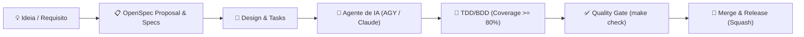

# Estudo de Spec-Driven Development (SDD) com OpenSpec, Antigravity e Claude Code

Este diretório consolida um estudo aprofundado e uma referência prática de **Spec-Driven Development (SDD)** (*Desenvolvimento Orientado a Especificações*) utilizando o framework [OpenSpec](https://github.com/openspec/openspec).

O objetivo deste estudo é demonstrar como a formalização prévia de especificações técnicas e de produto permite que assistentes de IA de linha de comando de última geração — como o **Antigravity CLI (`agy`)** da Google DeepMind e o **Claude Code (`claude`)** da Anthropic — atuem com autonomia máxima, determinismo, segurança e alta performance, entregando código limpo, testado e pronto para produção desde o primeiro ciclo.

---

## 🎯 O que é Spec-Driven Development (SDD)?

O **Spec-Driven Development (SDD)** é uma metodologia de engenharia de software na qual a especificação formal de requisitos, comportamento e arquitetura atua como a **única fonte da verdade** (*Single Source of Truth*) para todo o ciclo de vida do projeto:



1. **Alinhamento PO & QA**:
   - **Product Owner (PO)**: Regras de negócio descritas em linguagem ubíqua e acessível, com seções `## Purpose` claras e critérios de aceitação objetivos.
   - **Quality Assurance (QA)**: Cenários BDD/Gherkin formais (`#### Scenario:`, `- **WHEN**`, `- **THEN**`) prontos para tradução em suítes automatizadas de teste.
2. **Engenharia de Agentes de IA**:
   - **Harness Engineering**: Scaffolding determinístico de regras (`AGENTS.md`, `CLAUDE.md`, `.agent/rules/`) e permissões pré-autorizadas (`settings.json`).
   - **Loop Engineering**: Ciclos rápidos de ReAct/Reflection com auto-validação contínua via `make check`.
   - **Graph Engineering**: Orquestração do raciocínio e execução de tarefas como um Grafo Direcionado Acíclico (DAG / State Graph) sem dependências circulares.
   - **Native Tool Grounding**: Prioridade mandatória de ferramentas nativas de arquivos em vez de comandos de terminal bash.
   - **Token Economics**: Curação ativa de contexto, leitura/edição cirúrgica e respostas concisas com links clicáveis.

---

## 📚 Catálogo de Prompts Mestres de Fundação

Esta pasta disponibiliza uma suíte completa de **8 prompts mestres genéricos de fundação**, cobrindo as 4 principais linguagens do mercado, com versões dedicadas para o **Antigravity CLI (`agy`)** e para o **Claude Code (`claude`)**:

| Linguagem / Ecossistema | Harness de IA | Arquivo do Prompt | Destaques Técnicos e Ferramental |
| :--- | :--- | :--- | :--- |
| **Golang** | **Antigravity CLI** | [`generic-golang-foundation-spec-prompt-agy.md`](./generic-golang-foundation-spec-prompt-agy.md) | Clean Architecture em Go (`internal/`), CLI Cobra modular com `version` dinâmico via `ldflags`, TDD/BDD `testing`+`testify` &ge; 80%, Makefile universal, CI/CD GitHub Actions, `AGENTS.md`, `GEMINI.md`, `.agent/rules/` e ferramentas nativas AGY. |
| **Golang** | **Claude Code** | [`generic-golang-foundation-spec-prompt-claude.md`](./generic-golang-foundation-spec-prompt-claude.md) | Clean Architecture em Go (`internal/`), CLI Cobra modular com `version` dinâmico via `ldflags`, TDD/BDD `testing`+`testify` &ge; 80%, Makefile universal, CI/CD GitHub Actions, `CLAUDE.md`, `.claude/settings.json` e ferramentas nativas Claude (`Write`, `Edit`, `View`, `GrepTool`, `GlobTool`, `LS`). |
| **Python** | **Antigravity CLI** | [`generic-python-foundation-spec-prompt-agy.md`](./generic-python-foundation-spec-prompt-agy.md) | Clean Architecture (`src-layout`, PEP 621), **`uv`** (gestão de Python/venv/dependências), **`ty`** (type checker ultrarrápido da Astral), `pyproject.toml` mandatório, `pytest`+`pytest-cov` &ge; 80%, `ruff`, `pip-audit`, `AGENTS.md`, `GEMINI.md` e regras `.agent/`. |
| **Python** | **Claude Code** | [`generic-python-foundation-spec-prompt-claude.md`](./generic-python-foundation-spec-prompt-claude.md) | Clean Architecture (`src-layout`, PEP 621), **`uv`** (gestão de Python/venv/dependências), **`ty`** (type checker ultrarrápido da Astral), `pyproject.toml` mandatório, `pytest`+`pytest-cov` &ge; 80%, `ruff`, `pip-audit`, `CLAUDE.md`, `.claude/settings.json` e ferramentas nativas Claude. |
| **Node.js** | **Antigravity CLI** | [`generic-nodejs-foundation-spec-prompt-agy.md`](./generic-nodejs-foundation-spec-prompt-agy.md) | Clean Architecture em JavaScript moderno com ESM nativo (`"type": "module"`), `package.json` modular (`bin`, `exports`), `node:test`/Vitest com BDD &ge; 80%, Makefile com ESLint 9 Flat Config e Prettier, `AGENTS.md`, `GEMINI.md` e regras `.agent/`. |
| **Node.js** | **Claude Code** | [`generic-nodejs-foundation-spec-prompt-claude.md`](./generic-nodejs-foundation-spec-prompt-claude.md) | Clean Architecture em JavaScript moderno com ESM nativo (`"type": "module"`), `package.json` modular (`bin`, `exports`), `node:test`/Vitest com BDD &ge; 80%, Makefile com ESLint 9 Flat Config e Prettier, `CLAUDE.md`, `.claude/settings.json` e ferramentas nativas Claude. |
| **TypeScript** | **Antigravity CLI** | [`generic-typescript-foundation-spec-prompt-agy.md`](./generic-typescript-foundation-spec-prompt-agy.md) | Clean Architecture com tipagem estrita (`strict: true`, `NodeNext`), `package.json` modular (`exports`, `.d.ts`), Vitest com cobertura v8 &ge; 80%, `tsup`/`tsc`, ESLint + typescript-eslint + Prettier, `AGENTS.md`, `GEMINI.md` e regras `.agent/`. |
| **TypeScript** | **Claude Code** | [`generic-typescript-foundation-spec-prompt-claude.md`](./generic-typescript-foundation-spec-prompt-claude.md) | Clean Architecture com tipagem estrita (`strict: true`, `NodeNext`), `package.json` modular (`exports`, `.d.ts`), Vitest com cobertura v8 &ge; 80%, `tsup`/`tsc`, ESLint + typescript-eslint + Prettier, `CLAUDE.md`, `.claude/settings.json` e ferramentas nativas Claude. |

---

## 🏛️ Os 10 Pilares Universais de Engenharia

Todos os prompts desta suíte compartilham e adaptam para a linguagem alvo os **10 Pilares de Excelência**:

1. **Padrão Arquitetural e Layout Canônico**: Clean Architecture / Ports & Adapters com isolamento absoluto das entidades de domínio e regras de negócio.
2. **Pontos de Entrada, Modularidade e Versionamento Dinâmico**: Entrypoints declarativos e resolução de versão (release vs dev) em tempo de execução.
3. **Infraestrutura de Testes, TDD/BDD e Barreira Inegociável &ge; 80%**: Cenários BDD estruturados, mocks determinísticos e scripts de falha para cobertura inferior a 80%.
4. **Interface Universal de Comandos via Makefile Autodocumentado**: Alvos padronizados (`make help`, `setup`, `dev`, `run`, `test`, `lint`, `fmt`, `check`, `build`, `clean`).
5. **Stack de Aplicação e Dependências Customizáveis**: Liberdade para o solicitante definir frameworks e bibliotecas no prompt, com forte aplicação do **Princípio da Parcimônia**.
6. **Engenharia de Agentes, Harness, Loop & Graph Engineering**: Diretrizes determinísticas para o assistente de IA operar de forma autônoma e com economia ativa de tokens.
7. **Governança de Especificações com OpenSpec (Recomendado)**: Separação clara entre a visão de produto do **Product Owner (PO)** e os cenários de teste automatizáveis do **QA**.
8. **Pipelines de CI/CD e Matriz de Release Multiplataforma**: Workflows GitHub Actions parametrizáveis por `[PLATAFORMAS_ALVO]` com fallback inteligente.
9. **Documentação Viva e Exaustiva no README.md**: Badges funcionais, guia de uso da CLI, variáveis de ambiente e documentação de desenvolvedor.
10. **Governança Git, Conventional Commits e Squash Merge**: Commits semânticos (`feat:`, `fix:`), branches de feature por especificação e merge exclusivamente via **Squash** sob permissão explícita.

---

## 🚀 Como Utilizar os Prompts Mestres

### Passo 1: Escolha o Prompt Adequado
Identifique a linguagem do seu novo projeto e o assistente de linha de comando que você utilizará (ex: Python com Antigravity CLI &rarr; [`generic-python-foundation-spec-prompt-agy.md`](./generic-python-foundation-spec-prompt-agy.md)).

### Passo 2: Preencha as Variáveis do Projeto
Abra o arquivo, copie o texto da seção **Prompt de Fundação** e substitua as variáveis entre colchetes:
- `[NOME_DO_PROJETO]`: Nome do projeto (ex: `payment-gateway`).
- `[MODULO_GO]` / `[PACOTE_PYTHON]` / `[PACOTE_NODE]` / `[PACOTE_TS]`: Identificador do pacote.
- `[TIPO_DE_PROJETO]`: Ex: `API REST Headless`, `CLI`, `Worker Assíncrono`, etc.
- `[BINARIOS_OU_SERVICOS]` / `[ENTRYPOINTS_OU_SERVICOS]`: Nomes dos executáveis.
- `[STACK_E_FRAMEWORKS]`: Tecnologias desejadas (ex: `FastAPI + SQLAlchemy + asyncpg` ou `Cobra + standard library`).
- `[PLATAFORMAS_ALVO]`: Plataformas alvo (ex: `Linux x86_64, aarch64` ou vazio para usar o ambiente corrente).
- `[DESCRICAO_DO_PROJETO]`: Resumo objetivo do valor de negócio.

### Passo 3: Inicie a Geração no seu CLI de IA

No **Antigravity CLI** ou no **Claude Code**, execute:

```text
/openspec-propose Crie a especificação de fundação arquitetural e de engenharia 'project-foundation' para o projeto [NOME_DO_PROJETO] seguindo as diretrizes abaixo:
<cole o prompt preenchido>
```

O assistente gerará automaticamente toda a estrutura do OpenSpec (`proposal.md`, `design.md`, `specs/`, `tasks.md`), as regras de harness (`AGENTS.md` ou `CLAUDE.md`), a suíte de testes com cobertura &ge; 80% e a automação via Makefile!
